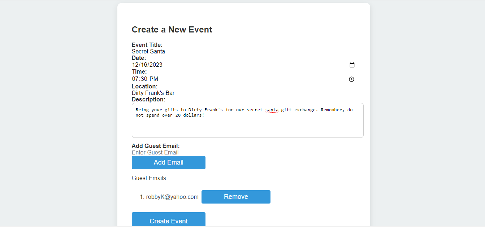
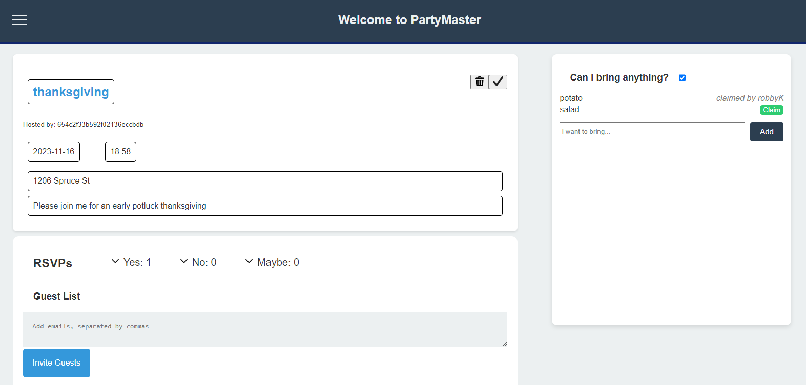

# PartyMaster

## Description

PartyMaster is a MERN Stack single-page application that serves as a one stop shop to make your party happening. Instead of playing phone tag with overlapping group chats and competing social media series, start your party here! Create your event and invite users via email to join the application and  a. RSVP, b. comment on the event details, and c. notate their contributions to your potluck.  
Once a user has created their account they will notice a user dashboard that will list all of the events they are either hosting or have RSVP’d for.  

To create PartyMaster we used React for the front end of the application. The app also relies on a GraphQL API with a Node.js and Express.js server. Thus, PartyMaster uses queries and mutations for retrieving, adding, updating, and deleting data. For our database, we used MongoDB and the Mongoose ODM. PartyMaster also includes user authentication through the use of JSON WebToken.

## Installation

If one is interested in getting PartyMaster's development envirenment running locally one can visit our github repo at this link: https://github.com/Albyhua/Project-3 

After obtaining a copy of the repository, one must run an npm install to install all of the necesarry dependencies.  One can then seed the application by running npm seed in the terminal. Once seeded, one must simply enter npm run dev which will run concurrently thus allowing our server and client sides to run. In the terminal one will notice a link to localhost:3000 which will bring them to the PartyMaster landing page. 

## Usage

Provide instructions and examples for use. Include screenshots as needed.
A user can begin planning their party on PartyMaster at this link: https://stark-hamlet-78991-77b45feb1011.herokuapp.com/ 

## Credits
Contributors: 
- Lucy Gouvin, Github Link: https://github.com/lucygouvin
- Albert Hua, Github Link: https://github.com/Albyhua
- Kojo Otchere, Github Link: https://github.com/kojootchere 
- Angela Figueroa, Github Link: https://github.com/AngelaFig 

