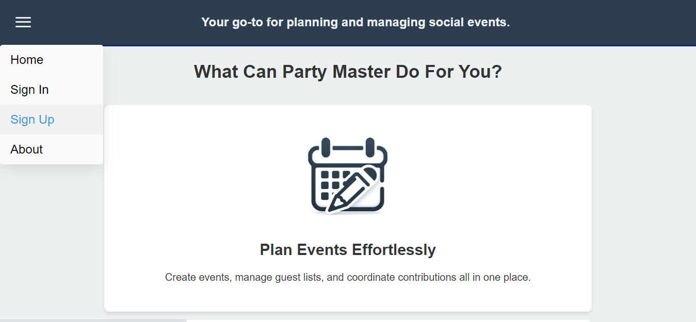
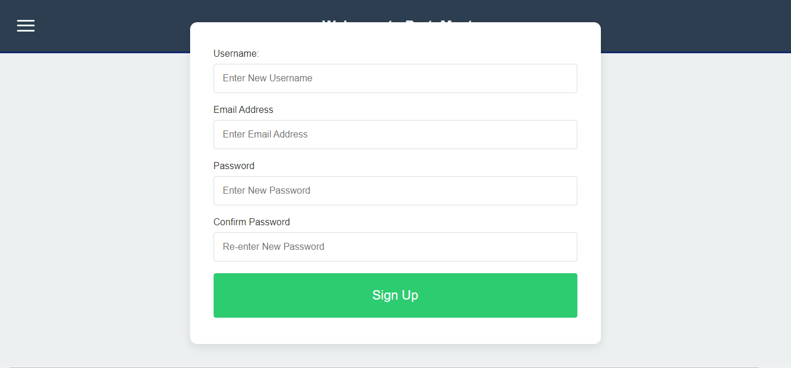
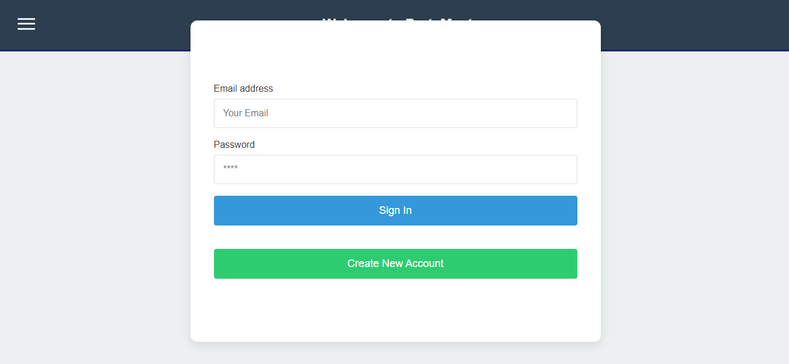
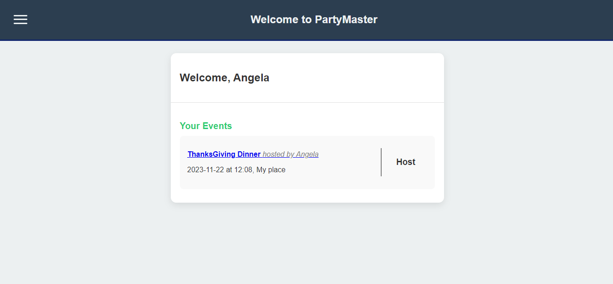
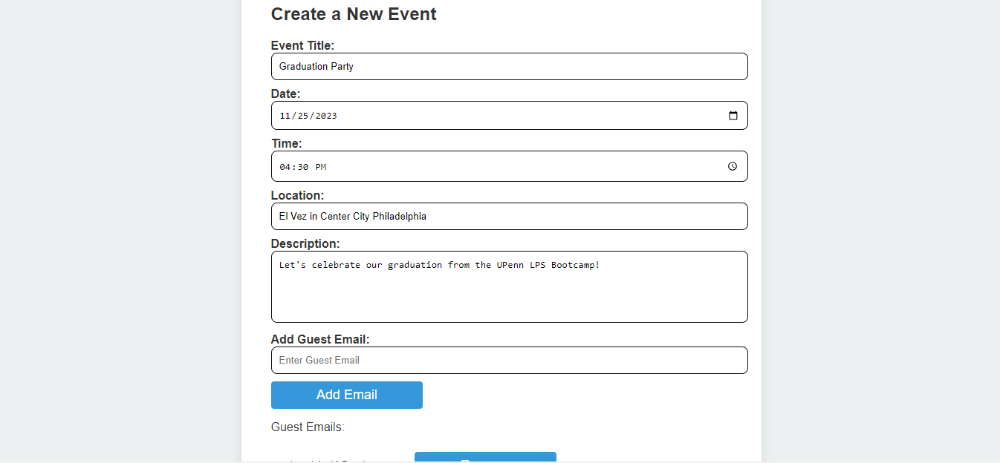
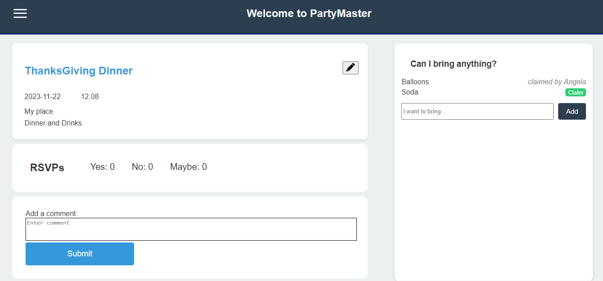

# PartyMaster

## Description

PartyMaster is a dynamic MERN Stack single-page application, designed to streamline party planning and coordination. This platform simplifies the party organization process by eliminating the need for multiple communication channels like group chats and social media. Here's how PartyMaster stands out:

1. Centralized Event Management: PartyMaster allows users to create and manage events in one place. Users can invite others via email to join the app where they can RSVP, discuss event details, and coordinate contributions for potluck-style gatherings.
2. User-Friendly Dashboard: Upon account creation, users are greeted with a personalized dashboard. This dashboard neatly displays all events they're hosting or attending, providing a clear overview of their social calendar.
3. Advanced Frontend Technology: The front end of PartyMaster is built using React, offering a responsive and intuitive user interface. React's component-based architecture ensures a smooth user experience.
4. Efficient Data Handling: At its core, PartyMaster utilizes a GraphQL API, managed by a robust Node.js and Express.js server. This setup allows for efficient data operations like fetching, adding, updating, and removing information, ensuring real-time updates and seamless data management.
5. Reliable Database Structure: MongoDB, coupled with the Mongoose ODM (Object Data Modeling), forms the backbone of PartyMaster's database. This combination offers flexibility and scalability, making it ideal for handling complex data structures needed for event management.
6. Secure User Authentication: Security is a top priority for PartyMaster. It incorporates JSON Web Token (JWT) for user authentication, ensuring secure access and protecting user data.

PartyMaster is more than just an event planning tool; it's a comprehensive platform that brings simplicity, efficiency, and security to the forefront of social event management.

## Table of Contents

- [Usage](#usage)
- [License](#license)
- [Installation](#installation)
- [Credits](#credits)
- [Link to the Deployed Application](#link-to-the-deployed-application)

## Usage

Instructions and examples for use can be found below:

## License

This project is licensed under the MIT License. For more details, please see the LICENSE file.

## Installation

For those eager to explore and contribute to PartyMaster's development, setting up the local environment is a straightforward process. Interested developers can begin by accessing our comprehensive GitHub repository here: https://github.com/Albyhua/Project-3

Here's a step-by-step guide to get you started:

1. Clone the Repository: First, clone the repository to your local machine. This step ensures you have all the necessary files to begin.
2. Install Dependencies: Once the repository is cloned, navigate to the project directory and execute npm install. This command will install all the dependencies required for PartyMaster to run smoothly.
3. Seed the Application: To populate the application with initial data, run npm seed in your terminal. This step is crucial for setting up a mock environment that resembles the actual application.
4. Start the Application: Launch the application by entering npm run dev in your terminal. This command runs both the server and client sides concurrently, thanks to the integrated functionality of the concurrently package.
5. Access the Local Version: After running the above command, a link to localhost:3000 will appear in your terminal. Clicking this link will take you directly to the PartyMaster landing page, allowing you to interact with your local version of the application.

By following these steps, developers can efficiently set up PartyMaster's development environment on their local machine, opening up opportunities for exploration, modification, and contribution to this innovative party planning platform.

## Credits

Contributors: 
- Lucy Gouvin, Github Link: https://github.com/lucygouvin
- Albert Hua, Github Link: https://github.com/Albyhua
- Kojo Otchere, Github Link: https://github.com/kojootchere 
- Angela Figueroa, Github Link: https://github.com/AngelaFig

## Link to Deployed Appliciation

Begin planning your next event on PartyMaster: https://stark-hamlet-78991-77b45feb1011.herokuapp.com